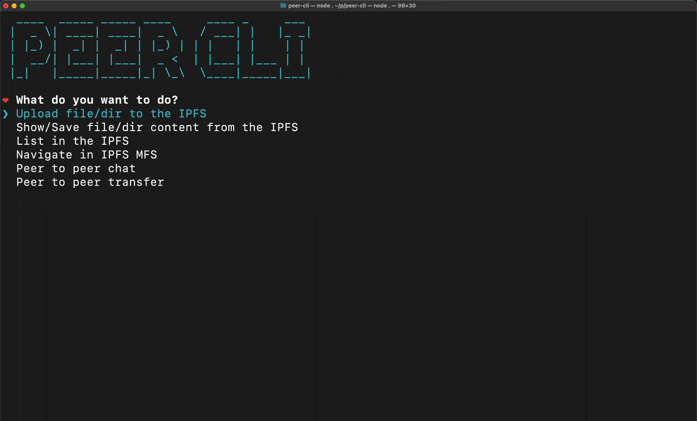
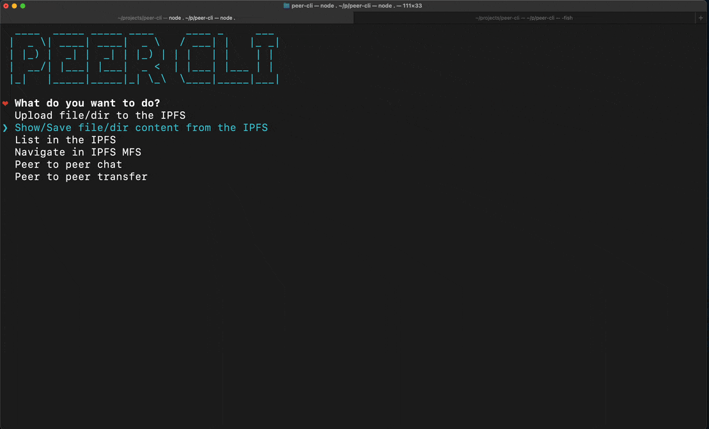

# Peer CLI

Swiss Army knife for the IPFS.

- [Peer CLI](#peer-cli)
  - [Install](#install)
  - [Features](#features)
    - [Upload File/Dir To The IPFS](#upload-filedir-to-the-ipfs)
    - [Show/Save File/Dir Contents from the IPFS](#showsave-filedir-contents-from-the-ipfs)
    - [List in the IPFS](#list-in-the-ipfs)
    - [Navigate in IPFS MFS](#navigate-in-ipfs-mfs)
    - [Peer to Peer Chat](#peer-to-peer-chat)

## Install

```bash
npm install -g peer-cli
```

## Features

### Upload File/Dir To The IPFS

You can easily upload file or directory to the IPFS.

With fuzzy search, you can easily find the file you want to upload to the IPFS. Also, progress bar is shown while uploading.



<br>

### Show/Save File/Dir Contents from the IPFS

You can easily show/save file or directory contents from the IPFS with given [CID](https://docs.ipfs.tech/concepts/content-addressing/#content-addressing-and-cids). Also, you can save the listed contents to your local file system.



<br>

### List in the IPFS

You can easily list file or directory contents in the IPFS with given [CID](https://docs.ipfs.tech/concepts/content-addressing/#content-addressing-and-cids).

- If the given CID is a file, you can either save the file, or show the file contents.
- If the given CID is a directory, you can save the contents to your local file system, or navigate to the directory.


<br>

### Navigate in IPFS MFS

Because files in IPFS are content-addressed and immutable, they can be complicated to edit. Mutable File System (MFS) is a tool built into IPFS that lets you treat files like you would a regular name-based filesystem — you can add, remove, move, and edit MFS files and have all the work of updating links and hashes taken care of for you ([Source](https://docs.ipfs.tech/concepts/file-systems/#mutable-file-system-mfs)).

This feature lets you easily manipulate files in the IPFS MFS like you are using Unix shell! The commands are very similar, thus you will not have any difficulty using them.

Available commands are:

> (...) indicates that the command can take multiple arguments. (e.g. `ls` can take multiple paths)

| Command | Options                    | Explanation                             |
| ------- | -------------------------- | --------------------------------------- |
| ls      | optional: \[path, ...\]    | List directory contents                 |
| cd      | \[path\]                   | Change directory                        |
| pwd     |                           | Output the current working directory    |
| mkdir   | \[path, ...\]              | Make directory                          |
| rm      | \[path, ...\]              | Remove file or directory                |
| stat    | \[path, ...\]              | Get file or directory statistics        |
| flush   | \[path, ...\]              | Flush a given path's data to the disk   |
| read    | \[path, ...\]              | Read a file                             |
| cat     | \[path, ...\]              | Alias for read                          |
| touch   | \[path, ...\]              | Update the mtime of a file or directory |
| write   | \[path\]                   | Write to an MFS path                    |
| open    | \[path\]                   | Alias for write                         |
| cp      | \[path\] \[to\]            | Copy files from one location to another |
| mv      | \[path\] \[to\]            | Move files from one location to another |
| help    | optional: \[command, ...\] | Show help                               |
| man     | optional: \[command, ...\] | Alias for help                          |
| clear   |                            | Clear the screen                        |
| exit    |                            | Exit the MFS shell                      |


<br>

### Peer to Peer Chat

Peer to peer chat is a feature that lets you chat with any peer that is visible through peer-cli. You can either discover peers through the peer discovery feature, or you can connect to a peer manually if you know the peer ID.

If you managed to connect to a peer, an authorization request will be sent to the peer. If the peer accepts the request, you two will be redirected to the chat room to say hello to each other (or whatever you want to say).

The feature uses [libp2p](https://libp2p.io/) to establish a connection between peers. libp2p plugin, `libp2p-webrtc-star` is used for discovering peers and establishing a connection through WebRTC. All messages are encrypted using [libp2p-noise](https://github.com/ChainSafe/js-libp2p-noise#readme) protocol. Discovery mechanism uses signalling server that we have deployed on a Heroku server. You can use your own signalling server by changing `starAddr` in `p2p.js`. You can find the example deployment of the signalling server [here](https://suda.pl/free-webrtc-star-heroku/)


